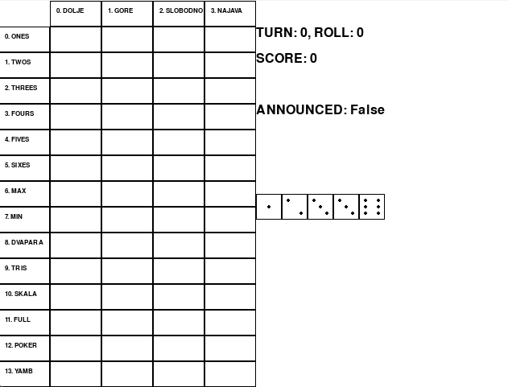

# yambot 🎲
Training a reinforcement learning agent to play Yamb, a Croatian dice game, because I could use all the help I can get.




## Features ✨
- 🎲 **Masked PPO Training** - Utilizes state-of-the-art [Proximal Policy Optimization with invalid action masking](https://arxiv.org/abs/2006.14171).
- 🏋️‍♂️ **Custom Gymnasium Environment** - Integrates [Gymnasium](https://gymnasium.farama.org/), an API standard for reinforcement learning, to simulate and train the AI model effectively.
- 💻 **GPU Acceleration** - Leverages Microsoft Azure's GPU resources for enhanced training efficiency.

## Rules of Yamb 📜
2 to 5 players, but can also be played solo.

**Objective**: Maximize **Total Score** below by strategically rolling dice, announcing and filling out the table.

**Gameplay**:
- Each player takes turns rolling five dice.
- You may roll up to three times per turn, choosing which dice to keep and which to re-roll.
- After your final roll, you must write your result in one of the available squares in the score table.
- The game consists of 48 rounds, and the player with the highest score at the end wins.

**Score Table**:
- Columns
  - **Down ⬇️**: You must fill this column from top to bottom in order.
  - **Up ⬆️**: You must fill this column from bottom to top in order.
  - **Free ⬆️⬇️**: You can fill this column in any order.
  - **Announcement 🔊**: After your first roll, you can choose to announce the square in this column you intend to fill out (provided it is free). After announcing, you must fill out that square after your two further rolls.
- Rows
  - **R1**: 1 x Number of 1s rolled. (e.g. \[1, 1, 1, 1, 3\] → 4 points).
  - **R2**: 2 x Number of 2s rolled. (e.g. \[1, 1, 1, 1, 3\] → 0 points).
  - **R3**: 3 x Number of 3s rolled. (e.g. \[1, 1, 1, 1, 3\] → 3 points).
  - **R4**: 4 x Number of 4s rolled. (e.g. \[4, 4, 1, 1, 3\] → 8 points).
  - **R5**: 5 x Number of 5s rolled. (e.g. \[5, 5, 5, 1, 3\] → 15 points).
  - **R6**: 6 x Number of 6s rolled. (e.g. \[6, 1, 1, 1, 3\] → 6 points).
  - **A**: If ∑ **Ri** >= 60 then ∑ **Ri** + 30 else ∑ **Ri**.
  - **Max**: Total of all the dice rolled. (e.g. \[5, 5, 5, 5, 5\] → 25 points).
  - **Min**: Total of all the dice rolled. (e.g. \[1, 1, 1, 1, 1\] → 5 points).
  - **B**: (**Max** - **Min**) x **R1**.
  - **2P**: 2 pairs. (e.g. \[6, 1, 1, 1, 1\] → 0 points).
  - **3K**: 3 of a kind. (e.g. \[6, 6, 6, 1, 1\] → 18 points).
  - **ST**: Straight.
  - **FH**: Full house.
  - **4K**: 4 of a kind.
  - **5K**: YAMB! 5 of a kind.
  - **C**: **2P** + **3K** + **ST** + **FH** + **4K** + **5K**.

**Total Score: A + B + C**

## Installation 🔧
If you want to train, test or evaluate locally, follow these steps:
1. Clone the repository:
   ```bash
   git clone https://github.com/aav31/yambot.git
   cd yambot
   ```
2. Create the conda environment:
   ```bash
   conda env create -f environment.yml
   ```
3. Activate the environment
   ```bash
   conda activate yambot
   ```

This will install all the necessary libraries and tools required to run the project.

## Folder Structure 📂
- [`configs`](configs): Contains ways of configuring the model to play Yamb.
- [`yamb`](yamb): A package containing the custom environment needed to simulate a game of Yamb.
- [`scripts`](scripts): Contains the scripts for training, testing, and evaluating yambot.

There are two folders hidden from git `models` and `logs` (folder which will contain log files for tensorboard).
You need to make these two folders.
Also drop the model_default_azure.zip into the models folder so you can use it.

## Usage 🚀
##### Training
To train from scratch (this will delete tensorboard logs and reset the episodes trained in the config file to be zero):
`python -m scripts.train --episodes 1000 --config "configs/model_default.json" --reset`

To continue training a model:
`python -m scripts.train --episodes 1000 --config "configs/model_default.json"`

On an azure machine or cluster use:
`python -m scripts.train --episodes 1000 --config "configs/model_default.json" --reset True --azure True`

To look at the results for each model:
`tensorboard --logdir=logs`

To create a new model create a new config `model_new.json`, set `episodes_trained=0`, rename `model_name=model_new`, run:
`python -m scripts.train --episodes 1000 --config "configs/model_new.json"`

##### Test and evaluation
If if you want to test the model by watching it play a game of yamb:
`python -m scripts.test --model_name model_default`

If you want to test the model by letting it play multpile games of yamb then be evaluated:
`python -m scripts.evaluate --model_name model_default --episodes 100`

##### Playing yamb yourself
This functionality is a way to play yamb yourself, and is more a full test of whether the environment is truly working as we expect:
`python -m scripts.yamb_yourself`

## License 📄

## Tests ✅
To run the unit tests, from the root directory run:
`python -m unittest discover -v`


