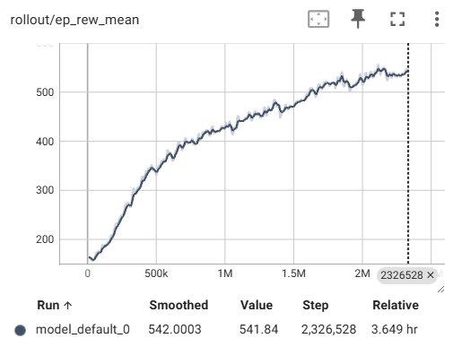

# yambot 🎲
Training a reinforcement learning agent to play Yamb, a Croatian dice game, because I could use all the help I can get.

**Note: The demo GIF may take a few seconds to load. Please be patient.**


With a couple of hours training, the model is able to achieve a score of about 850; around the score of a beginner. With GPU training, it would probably be able to compete with a decent player.



## Features ✨
- 🎲 **Masked PPO Training** - Utilizes state-of-the-art [Proximal Policy Optimization with invalid action masking](https://arxiv.org/abs/2006.14171).
- 🏋️‍♂️ **Custom Gymnasium Environment** - Integrates [Gymnasium](https://gymnasium.farama.org/), an API standard for reinforcement learning, to simulate and train the AI model effectively.
- ☁️ **Azure Integration** - Harnesses the power of Microsoft Azure for enhanced training performance.

## Rules of Yamb 📜
2 to 5 players, but can also be played solo.

**Objective**: Maximize **Total Score** below by strategically rolling dice, announcing and filling out the table.

**Gameplay**:
- Each player takes turns rolling five dice.
- You may roll up to three times per turn, choosing which dice to keep and which to re-roll.
- After your final roll, you must write your result in one of the available squares in the score table.
- The game consists of 48 rounds, and the player with the highest score at the end wins.

**Table**:
- Columns
  - **0. DOLJE ⬇️**: You must fill this column from top to bottom in order.
  - **1. GORE ⬆️**: You must fill this column from bottom to top in order.
  - **2. SLOBODNO ⬆️⬇️**: You can fill this column in any order.
  - **3. NAJAVA 🔊**: After your first roll, you can choose to announce the square in this column you intend to fill out (provided it is free). After announcing, you must fill out that square after your two further rolls.
- Rows
  - **0. ONES**: 1 x Number of 1s rolled. (e.g. \[1, 1, 1, 1, 3\] → 4 points).
  - **1. TWOS**: 2 x Number of 2s rolled. (e.g. \[1, 1, 1, 1, 3\] → 0 points).
  - **2. THREES**: 3 x Number of 3s rolled. (e.g. \[1, 1, 1, 1, 3\] → 3 points).
  - **3. FOURS**: 4 x Number of 4s rolled. (e.g. \[4, 4, 1, 1, 3\] → 8 points).
  - **4. FIVES**: 5 x Number of 5s rolled. (e.g. \[5, 5, 5, 1, 3\] → 15 points).
  - **5. SIXES**: 6 x Number of 6s rolled. (e.g. \[6, 1, 1, 1, 3\] → 6 points).
  - **6. MAX**: Total of all the dice rolled. (e.g. \[5, 5, 5, 5, 5\] → 25 points).
  - **7. MIN**: Total of all the dice rolled. (e.g. \[1, 1, 1, 1, 1\] → 5 points).
  - **8. DVAPARA**: 2 pairs. (e.g. \[6, 1, 1, 1, 1\] → 0 points).
  - **9. TRIS**: 3 of a kind. (e.g. \[6, 6, 6, 1, 1\] → 18 points).
  - **10. SKALA**: Straight.
  - **11. FULL**: Full house.
  - **12. POKER**: 4 of a kind.
  - **13. YAMB**: YAMB! 5 of a kind.

**Scoring**
- **A**: If **ONES + TWOS + ... + SIXES** >= 60 then **ONES + TWOS + ... + SIXES** + 30 else **ONES + TWOS + ... + SIXES**.
- **B**: (**MAX** - **MIN**) x **ONES**.
- **C**: **DVAPARA** + **TRIS** + **SKALA** + **FULL** + **POKER** + **YAMB**.
- **Total Score: A + B + C**

## Installation 🔧
If you want to train, test or evaluate locally, follow these steps:
1. Clone the repository:
   ```bash
   git clone https://github.com/aav31/yambot.git
   cd yambot
   ```
2. Create the conda environment:
   ```bash
   conda env create -f environment.yml
   ```
3. Activate the environment
   ```bash
   conda activate yambot
   ```

This will install all the necessary libraries and tools required to run the project.

## Folder Structure 📂
- [`configs`](configs): Contains ways of configuring the model to play Yamb.
- [`media`](media): Contains images and videos demonstrating model performance.
- [`models`](models): Folder containing trained reinforcement learning models.
- [`scripts`](scripts): Contains the scripts for training, testing, and evaluating yambot.
- [`tests`](tests): Contains tests for the custom Yamb environment.
- [`yamb`](yamb): A package containing the custom environment needed to simulate a game of Yamb.

A `logs` folder which contains log files for tensorboard is hidden from git.

## Usage 🚀
#### Training
To train from scratch (this will delete tensorboard logs and reset the episodes trained in the config file to be zero):
```bash
python -m scripts.train --episodes 1000 --config "configs/model_default.json" --reset
```

To continue training a model:
```bash
python -m scripts.train --episodes 1000 --config "configs/model_default.json"
```

On an azure machine or cluster use:
```bash
python -m scripts.train --episodes 1000 --config "configs/model_default.json" --reset True --azure True
```

To look at the results for each model:
```bash
tensorboard --logdir=logs
```

To create a new model:
- Create a new config `model_new.json`
- Set `episodes_trained=0`
- Rename `model_name=model_new`
- Run:
  ```bash
  python -m scripts.train --episodes 1000 --config "configs/model_new.json"
  ```

#### Evaluation
If if you want to test the model by watching it play a game of yamb:
```bash
python -m scripts.test --model_name model_default
```

If you want to test the model by letting it play multpile games of yamb then be evaluated:
```bash
python -m scripts.evaluate --model_name model_default --episodes 100
```

#### Playing yamb yourself
This functionality is a way to play yamb yourself, and is more a full test of whether the environment is truly working as we expect:
```bash
python -m scripts.yamb_yourself
```

## License 📄
This project is licensed under the MIT License. See the [LICENSE](LICENSE) file for more details.


## Tests ✅
To run the unit tests, from the root directory run:
```bash
python -m unittest discover -v
```


